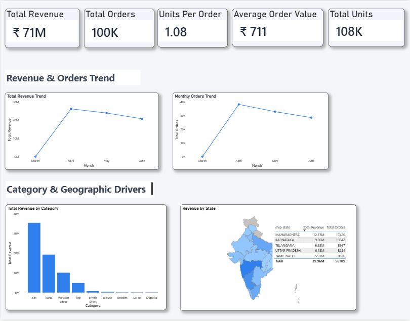

# Amazon Sales & Operational Performance Analysis (India)

**Tools Used:** MySQL | Python (Pandas, Matplotlib) | Power BI  
**Dataset Size:** 100,000+ Orders | ₹71M Revenue  
**Domain:** E-Commerce | Retail Analytics  

---

## 📊 Project Overview

This project analyzes Amazon India fashion sales data to identify:

- Revenue drivers
- Operational performance trends
- Category concentration risk
- Geographic revenue clustering

The objective was not just to report totals, but to understand **what is actually driving revenue performance**.

The workflow combines:

- **SQL** for data validation and aggregation  
- **Python** for analytical decomposition and correlation analysis  
- **Power BI** for executive-level dashboard visualization  

---

## 🗂 Dataset Summary

- Total Revenue: ₹71M  
- Total Orders: ~100K  
- Total Units Sold: 108K  
- Average Order Value (AOV): ₹711  
- Units per Order: 1.08  

Data Period: March 2022 – June 2022  

---

## 🔍 Key Business Insights

### 1️⃣ Revenue Is Order-Driven

Revenue decline from April to June was primarily caused by a drop in **order volume**, not pricing.

Revenue = Orders × Units per Order × Price

- Units per order remained stable
- Average price slightly increased
- Orders declined significantly

Conclusion:
Revenue movement was **volume-driven**, not price-driven.

---

### 2️⃣ Category Concentration Risk

Revenue is heavily concentrated in:

- **Set**
- **Kurta**

These two categories contribute the majority of revenue.

Business Risk:
High dependency on limited product segments.

---

### 3️⃣ Geographic Revenue Clustering

Top Revenue States:

- Maharashtra
- Karnataka
- Telangana
- Uttar Pradesh
- Tamil Nadu

Revenue is concentrated in western and southern regions of India.

Business Implication:
Urban, high purchasing power markets dominate revenue.

---

## 📈 Dashboard Preview

### KPI Overview
- Total Revenue
- Total Orders
- Units per Order
- Average Order Value
- Total Units

### Trend Analysis
- Monthly Revenue Trend
- Monthly Orders Trend

### Driver Analysis
- Revenue by Category
- Revenue by State (Map + Top 5 Table)

---

## 🛠 Technical Workflow

### 1️⃣ SQL Layer
- Data cleaning
- Duplicate validation
- Revenue aggregation
- Order-level metrics
- Category and state-level grouping

### 2️⃣ Python Layer
- Feature engineering
- Price per unit calculation
- Correlation analysis
- Revenue decomposition
- Trend visualization

### 3️⃣ Power BI Layer
- KPI card modeling
- Revenue & order trend dashboards
- Category driver visualization
- Geographic revenue mapping
- Executive layout structuring

---

## 💡 Business Recommendations

- Focus on increasing order volume through marketing campaigns.
- Diversify category mix to reduce concentration risk.
- Expand targeting in high-performing states.
- Monitor monthly order decline closely to prevent sustained revenue drops.

---

## 🚀 Conclusion

This project demonstrates the ability to:

- Perform end-to-end data analysis
- Decompose revenue drivers
- Translate analytics into business insights
- Build executive-level BI dashboards

