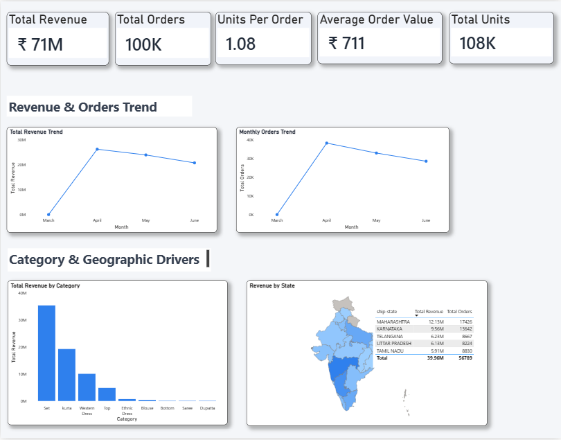

# Amazon Sales & Operational Performance Analysis (India)

**Tools Used:** MySQL | Python (Pandas, Matplotlib) | Power BI  
**Dataset Size:** 100,000+ Orders | ₹71M Revenue  
**Domain:** E-Commerce | Retail Analytics  

---

## 📊 Project Overview

This project analyses Amazon India fashion sales data to identify:

- Key revenue drivers  
- Operational performance trends  
- Category concentration risk  
- Geographic revenue clustering  

The focus is not just on reporting metrics, but on **quantifying what drives revenue performance** using structured analytical methods.

The workflow combines:

- **SQL** for data validation and aggregation  
- **Python** for decomposition analysis and demand insights  
- **Power BI** for executive-level dashboard visualisation  

---

## 🗂 Dataset Summary

- **Total Revenue:** ₹71M  
- **Total Orders:** ~100K  
- **Total Units Sold:** ~108K  
- **Average Order Value (AOV):** ₹711  
- **Units per Order:** ~1.08  

**Data Period:** March 2022 – June 2022  

---

## 🔍 Key Business Insights

### 1️⃣ Revenue Decline Was Driven by Order Contraction

Revenue declined by **~21% from April to June**, primarily driven by a **~25% drop in order volume**.

A decomposition of revenue shows:

- **Order volume contributed >120% of the decline**
- **AOV increased (~6%) and offset ~21% of the loss**

This confirms that the decline was **volume-driven, not price-driven**.

---

### 2️⃣ Revenue Is Highly Concentrated

Revenue is heavily concentrated in a few categories:

- **Set → ~50%**
- **Kurta → ~27%**

Combined:

- **Top 2 categories → ~77% of total revenue**
- **Top 3 categories → >91% of total revenue**

**Business Risk:**  
High dependency on a narrow product portfolio increases vulnerability to demand shifts.

---

### 3️⃣ Demand Is Category-Driven, Not Price-Driven

- No strong linear relationship between **price and quantity** at transaction level  
- High-priced categories (e.g., Set) still generate the highest demand  
- Low-priced categories do not necessarily drive higher volume  

**Conclusion:**  
Customer purchase decisions are driven more by **product category and perceived value** than by price variation.

---

### 4️⃣ Basket Size Is Stable

- Units per order remain stable at **~1.07–1.08**

**Implication:**  
- Customers typically purchase **single items per transaction**  
- Limited cross-selling and bundling behaviour  

---

### 5️⃣ Revenue Is Driven by Customer Traffic

Since revenue decline is fully explained by reduced order volume while:

- AOV increased  
- Units per order remained stable  

👉 Business performance is primarily driven by **traffic and conversion**, not pricing strategy.

---

### 6️⃣ Revenue Is Geographically Concentrated

Top contributing states:

- Maharashtra  
- Karnataka  
- Telangana  
- Uttar Pradesh  
- Tamil Nadu  

👉 **Top 5 states contribute ~56% of total revenue**

**Implication:**  
Revenue is concentrated in **high-value, urban markets**, indicating both growth opportunity and regional dependency risk.

---

## 📈 Dashboard Preview

### KPI Overview
- Total Revenue  
- Total Orders  
- Units per Order  
- Average Order Value  
- Total Units  

### Trend Analysis
- Monthly Revenue Trend  
- Monthly Orders Trend  

### Driver Analysis
- Revenue by Category  
- Revenue by State (Map + Top 5 Table)  

---

## 🛠 Technical Workflow

### 1️⃣ SQL Layer
- Data cleaning and validation  
- Handling zero/negative transactions  
- Revenue aggregation  
- Order-level metric computation  
- Category and state-level grouping  

---

### 2️⃣ Python Layer
- Feature engineering (price per unit, time features)  
- Revenue decomposition (**Orders vs AOV contribution**)  
- Correlation and demand analysis  
- Category-level and geographic analysis  
- Trend visualisation  

---

### 3️⃣ Power BI Layer
- KPI card modelling  
- Monthly performance dashboards  
- Category concentration visuals  
- Geographic revenue mapping  
- Executive-level layout design  

---

## 💡 Business Recommendations

### 1. Prioritise Order Growth

Reverse the **~25% decline in order volume** through:

- Targeted customer acquisition campaigns  
- Improved platform visibility  
- Retention and repeat purchase strategies  

---

### 2. Reduce Category Concentration Risk

With **~77% revenue from top 2 categories**, focus on:

- Scaling mid-tier categories (Western Dress, Top)  
- Expanding product assortment  
- Running targeted category campaigns  

---

### 3. Improve Cross-Selling and Basket Size

Increase units per order (~1.07) through:

- Product bundling strategies  
- Personalised recommendations  
- Multi-item offers  

---

### 4. Optimise Traffic and Conversion

Since revenue is traffic-driven:

- Improve product listings and UX  
- Target high-intent customers  
- Focus on conversion optimisation rather than aggressive discounting  

---

### 5. Implement Order Trend Monitoring

- Track monthly order trends  
- Set threshold-based alerts  
- Enable early intervention before revenue decline accelerates  

---

## 🚀 Conclusion

This project demonstrates the ability to:

- Perform end-to-end data analysis using SQL, Python, and Power BI  
- Quantitatively decompose revenue drivers  
- Translate data into actionable business insights  
- Identify structural risks in category and geographic concentration  
- Build executive-level dashboards for decision-making  
